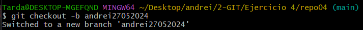
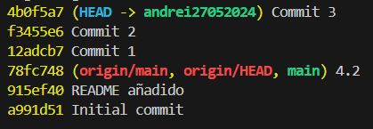
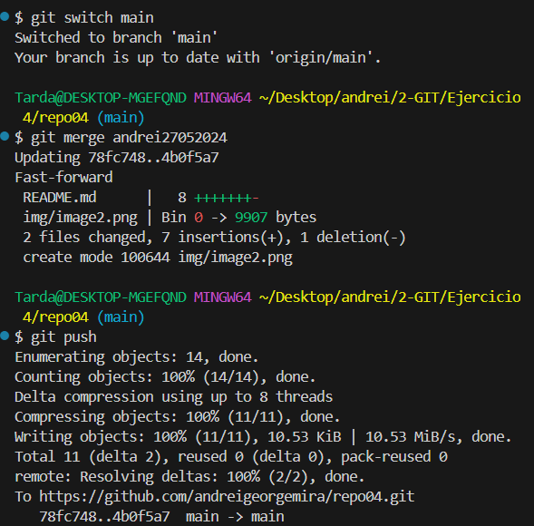
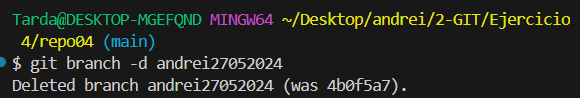
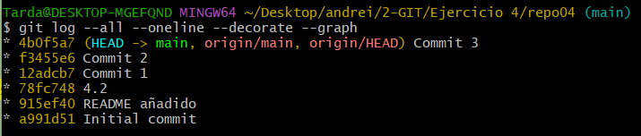
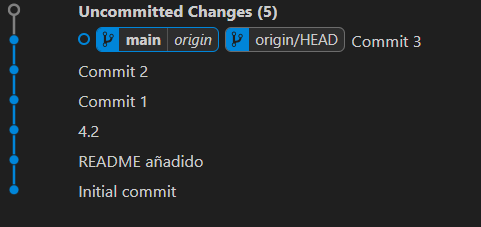

# Ejercicio 4

## 4.1
Yo he creado el repo en remoto y le he hecho un clone, asi me ahorraba tener que hacer init, cambiar la branca a main, añadir repositorio remoto y todo eso.

## 4.2 

## 4.3

## 4.4
Al añadir estas lineas ya sera el fichero diferente al de antes. Por ello no hago aqui todo en este fichero y no creo otro nuevo

## 4.5 

## 4.6

## 4.7

## 4.8

